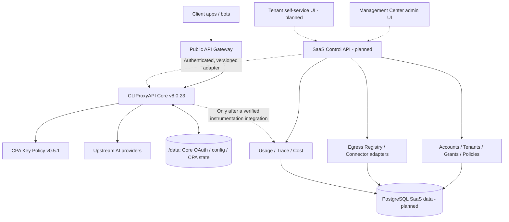
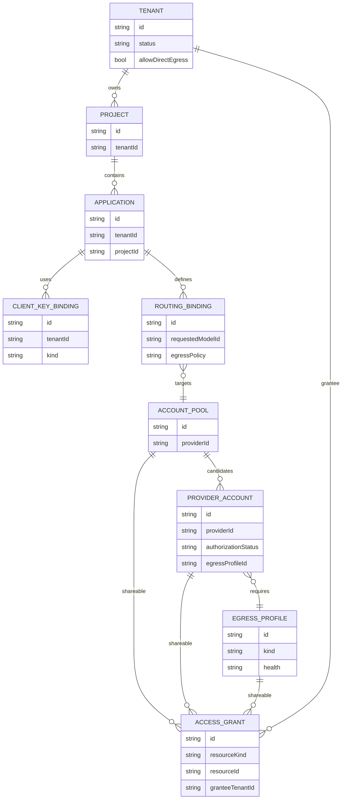
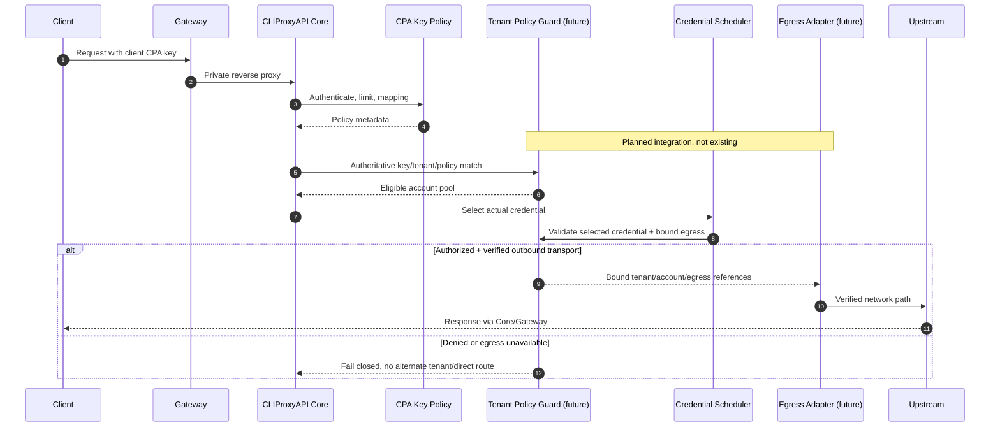

# SaaS Blueprint B — архитектура (версия проекта 1)

**Статус: спецификация + автономный прототип policy resolver. Не production.**
База проектирования: CLIProxyAPI Core v8.0.23 + CPA Key Policy v0.5.1,
Management Center (React/Bun) и отдельный API Gateway.

## 1. Модульный монолит, а не один процесс

Единый продукт = единая навигация, контракты, модель клиентов, аудит, release
документация. **Не** означает объединение Core/Gateway/PostgreSQL/VPN в один
бинарник. Новую бизнес-логику размещаем в SaaS Control API с портами/адаптерами,
а изменения живого Core допускаем только через проверенный интеграционный слой.



Сплошные стрелки от клиентов к Core = существующий рабочий контур;
всё в секциях SaaS Control — **будущий проект**, пунктир не означает
работающий API. Admin Management API сейчас частный и не должен напрямую
становиться общим tenant-admin API.

## 2. Границы доверия и виды идентификаторов

- `tenant_id`, `application_id` и `selected_account_id` устанавливает
  доверенный backend после аутентификации и выбора планировщиком; **не**
  берём значения из клиентского HTTP-заголовка.
- `ClientKeyBinding` хранит только внутреннюю ссылку на клиентский CPA-ключ,
  а НЕ `cpa_…` в открытом виде. Обычные ключи Core `access.api-keys`
  заблокированы в SaaS data plane.
- `ProviderAccount` хранит метаданные провайдера и владельца. Настоящий ключ,
  OAuth-токен, refresh-token или его vault handle никогда не сериализуется
  в публичный API/React.
- `EgressProfile` содержит тип, публично допустимый host/port или
  непрозрачный connector ID. Логин/пароль прокси, VPN-конфигурация и
  ключи остаются в отдельном защищённом хранилище.
- Владелец аккаунта / пула / egress: конкретный tenant или platform.
  Платформенный аккаунт **не доступен всем автоматически**.

### Контракты прототипа

```text
src/features/saasBlueprint/
  domain.ts              // versioned pure type contracts
  egressValidation.ts    // static shape + obvious SSRF block
  resolveRoute.ts        // deterministic fail-closed policy simulator
  safeDecisionPreview.ts // whitelist-only UX timeline, no secrets
```

Сейчас импорты модулей не включены в React Router, реальные HTTP, OAuth,
CPA Key Policy, Gateway и хранилище. Ни одно решение симулятора не
обеспечивает реальную защиту до backend wiring + тестов на стенде.

## 3. Доменная модель



Этот ERD логический: `AccountPool.accountIds` сейчас массив ID, в будущей
PostgreSQL-схеме нужна join-таблица `PoolMembership` с уникальными ключами,
целостностью и аудируемыми изменениями.

## 4. Неизменяемые правила tenant isolation

1. Активны tenant, project, application и CPA key binding.
2. Один модельный alias однозначно связывается с policy (никаких first-match
   при конфликтующих настройках).
3. Группа, выбранный Core scheduler аккаунт и egress должны существовать,
   быть активны, иметь ожидаемого владельца и *каждый отдельно* быть
   доступен данному tenant через ownership либо действующий `AccessGrant`.
4. Разрешение платформенного/shared pool **не** выдаёт доступ автоматически
   ко всем аккаунтам и сетям этого пула.
5. Провайдер и модель account должны соответствовать policy;
   `authorizationStatus` обязан быть `approved`. Потребительские
   подписки/OAuth не считаются одобренными автоматически.
6. Неизвестный, отключённый, повреждённый или непроверенный egress = отказ.
   Если `egressPolicy=required`, переход на direct запрещён.
7. Direct допускается только при **двух** флагах: разрешение tenant
   + `egressPolicy=direct-explicit`. Профиль direct должен быть выбран явно.
8. VPN Connector допускается только после отдельной установки, проверки
   идентичности/доступности и добавления ID в проверенный реестр backend.
9. Изменение grants, auth, egress, health и policies должно инвалидировать
   устаревшие decisions. Требуются версии/ETag и защита от TOCTOU.
10. Отрицательное решение не содержит чужие аккаунты, токены, секреты или
    подробности секретной конфигурации. Доступные причины локализуются в UI.

## 5. Где будет реальное enforcement (ещё НЕ реализовано)



**Блокер:** существующий CPA scheduler не гарантирует ни tenant isolation,
ни принудительное прохождение всех видов трафика через заданный VPN.
До реализации enforcement ограничить BYOA/BYOK одним доверенным оператором
или использовать выделенный Core для отдельного клиента. UI-проверка
без backend контроля недостаточна.

## 6. Прокси, VPN и сетевые риски

| Путь | Поддержка Core | План |
| --- | --- | --- |
| Global `requests.proxy-url` | Да | Показывать в legacy Network settings |
| OAuth credential `proxy_url` | Да | Отображать метаданные только администратору |
| HTTP(S), SOCKS5(H) | Да | Каталог с safe host/port, проверкой здоровья |
| Explicit `direct` / `none` | Да | SaaS запрет по умолчанию |
| Per-tenant VPN / WireGuard / Tailscale | НЕ является готовой функцией | Раздельный VPN adapter |
| Network-level DNS/SSRF enforcement | Не доказан для SaaS | Обязательная проверка |

Статическая проверка `validateProxyEndpoint` отклоняет очевидные localhost,
metadata, приватные IPv4, IPv6 literals, псевдо-TLD, вложенные URI и
userinfo. Она **не делает DNS-запросов** и не защищает от DNS rebinding:
перед реальной связью нужно проверить A/AAAA, запретить private/link-local
адреса (включая IPv6, IPv4-mapped), ограничить пересоздание соединений,
редиректы и DNS resolution и выставить настоящие egress firewall правила.
Tenant не должен задавать произвольные proxy URL из публичного API.

Нужны обязательные интеграционные тесты API HTTP, SSE, WebSocket, OAuth
refresh, модели через прокси, timeouts, DNS fail, proxy auth error (407),
IP egress check и reconnect. Сбой VPN/proxy = **fail closed**, не default
route и не переключение на аккаунт другого tenant.

## 7. Открытые интерфейсы для будущей разработки

Отдельные порты SaaS Control API:
- `TenantRepository` / `ProjectRepository` / `ApplicationRepository`;
- `AccountCatalog` / `ProviderCapabilitiesRegistry` (правомерный auth mode);
- `CpaKeyBindingAdapter` (opaque reference без хранения plaintext CPA-ключа);
- `RoutePolicyResolver` / `CredentialSelectionVerifier`;
- `EgressRegistry` / `EgressConnector` с проверяемым Network Enforcement;
- `SecretVault` (шифрование/ротация/доступ), не импортируется React UI;
- `UsageEventSink` / `TraceStore` / `PricingEngine` / `AuditLog`.

Контракт интерфейсов, транспорт и зависимости реализуются позже, отдельно от
pure model; не вводить сетевые запросы, глобальный state и framework imports
в `src/features/saasBlueprint`. Не добавлять Zod/ORM/DB прежде, чем выбран
backend и создана тестируемая граница данных.

## 8. Функционал SaaS-клиента и роли

- **Platform admin**: системные интеграции и audit, но не просмотр клиентских
  секретов и не расшаривание без явной политики.
- **Tenant owner/admin**: свои проекты, ключи, аккаунты, outbound routes,
  grants на принадлежащие ему ресурсы, usage/budget.
- **Tenant viewer**: метрики и безопасные статусы без секретов/изменений.
- Self-service frontend позже получает tenant-scoped JWT/сессию через SaaS API,
  а НЕ общий Management Secret Core. Публичный Gateway сохраняет запрет
  management endpoints.

## 9. Наблюдаемость и точность

Сначала трассировка **решения политики** (simulation/deny/allow), только потом
**реальных событий** с интеграционным контрактом и подтверждёнными
timestamp/account/egress. Различать `simulated` / `observed` / `verified`.
Секреты, заголовки Authorization, cookies и raw промпты не включать.
Учёт токенов должен различать input/output/cache/reasoning и степень
достоверности; счёт и бюджет — по версионированному pricing ledger с
idempotency key. Аналитика не должна блокировать обработку запроса.

## 10. Хранение, резервирование, изменения

- `/data` (Railway volume): текущие Core/OAuth/CPA секреты и состояние, НЕ
  трогать в рамках этого Blueprint.
- Отдельный PostgreSQL для SaaS: tenant-aware PK/FK, RLS как дополнительный
  защитный слой, индексы, неизменяемый audit, retention/deletion.
- Vault для клиентских API-ключей/credential secret, приложение хранит
  только ссылки; не секреты в Postgres текстом или frontend.
- Schema model `SAAS_BLUEPRINT_SCHEMA_VERSION=1`; версии будущих HTTP/DB
  схем и событий развивать отдельно, с миграциями, rollback и contract tests.
- Функционал вводить через feature flags, сначала read-only, затем стенд,
  затем ограниченный rollout. Production Core SHA pinned, отдельный release.

## Демонстрационное представление request path (SIMULATED)

В SaaS UI рисуется семиузловая **логическая** цепочка Client → Gateway → CPA Policy → Pool → Account → Egress → Provider. Показанные этапы политики берутся исключительно из чистого `safeDecisionPreview`; Gateway/Provider явно имеют обозначение `illustrative` и не являются ни тестами сети, ни фактом отправки запроса. Настоящее runtime enforcement и серверная изоляция ресурсов относятся к будущему SaaS Control API/adapter; включать Core или публиковать Gateway для просмотра этой схемы нельзя.

## UX-итерация 2: безопасная проекция контекста запроса

Функция `projectScenarioContext` возвращает только разрешённые демонстрационные ссылки: проект/приложение, CPA binding, пул, аккаунт, сетевой профиль, владелец и доступ. **Имена и ID недоступного tenant resource исключаются до передачи в UI**. Контекст не содержит URL с секретами, API-ключей, OAuth-токенов, VPN-конфигураций и raw request/response. `buildDemoFlow` проецирует результаты чистого resolver на семь этапов без network I/O.

Эта frontend-изоляция — только **SIMULATED**, не enforcement. Для настоящего SaaS Control API следует реализовать серверную проверку AuthZ/RBAC + grants на каждой выдаче read-only metadata, а не передавать весь snapshot клиенту. Gateway и AI Provider всегда обозначаются `illustrative`, не `passed`, даже если решение resolver — allow.

## Изолированный браузерный QA (SIMULATED)

Браузерный smoke-test работает против локального `http://127.0.0.1:5173/#/saas-demo-preview` с флагом `true`, не против Railway/Core/Gateway. Workflow запускает только Vite и временный Chromium, загружает screenshot-артефакты (только синтетические данные) и проверяет отсутствие внешних HTTP-вызовов. Egress/VPN, SaaS AuthZ, CPA enforcement и реальные provider connections этим тестом **не проверяются**. CI не осуществляет deploy и не изменяет release `management.html`.

## Изоляция автоматического WCAG-аудита

`tests/browser/saas_demo_browser.py` вызывает axe-core 4.10.3 через
`page.add_script_tag` **только на локальном синтетическом preview**
(`data-saas-demo-root`). Пакет ставится во временный каталог runner
и не добавляется в `package.json` / `bun.lock` / production HTML.

Контрольные условия: никаких внешних HTTP-запросов, браузерных исключений
и горизонтального переполнения, проверка tenant switch, ресурсов,
клавиатуры и reduced-motion. Отчёты содержат только синтетические данные;
в GitHub artifacts сохраняются не более 7 дней. Автоматический аудит
сообщает также `incomplete`-проверки, которые должны быть оценены человеком.
Никаких подтверждений server-side AuthZ, маршрутизации Core, VPN либо
runtime network isolation эта проверка не предоставляет.

